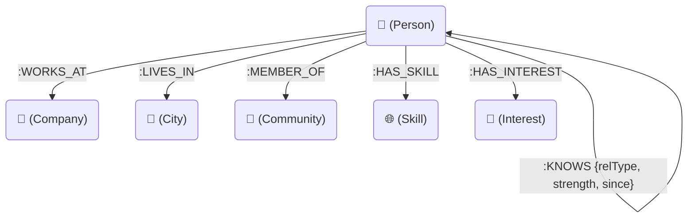

# ConnectGraph — Professional Graph Network & Traversal Explorer

ConnectGraph is a relationship-driven social and professional networking application built for the Wexa AI take-home assignment. The project demonstrates how graph database queries map mutual connections, professional skill hubs, interest groups, and multi-hop introduction paths.

The application is backed by **CognoDB Cloud** (or a Neo4j-compatible instance) and features a dual-mode **transparent fallback system** to keep the application 100% operational even if the database is offline.

---

## 1. Why a Graph Database for this Use Case?

In standard relational (SQL) databases, entities are stored in rigid tables (e.g. `People`, `Skills`, `Interests`), and relationships are mapped using intermediate join tables (e.g. `PersonSkills`, `PersonInterests`). 

As a result:
* **Nested Joins**: Querying connection paths up to 4 hops deep (Origin → Person A → Person B → Target) requires multiple nested self-joins or recursive CTEs, degrading database read performance exponentially.
* **Complex Recommendation Queries**: Writing a query to find people who share a company, community, skills, and interests requires multiple tables join and aggregations that relational databases find highly awkward.

In **CognoDB** (using openCypher over the Bolt protocol):
* **Index-Free Adjacency**: Relationships are stored as physical pointers directly on disk, eliminating runtime joins.
* **Traversal Efficiency**: Finding connection pathways takes milliseconds since it hops between adjacent pointers in memory.
* **Single-Statement Recommendations**: Similarity matching based on weighted overlays (shared skills, company, community, and mutual connections) is expressed clearly in a single query.

---

## 2. Graph Data Model

The application models a professional network containing 6 distinct node labels and 6 relationship types.

### Schema Diagram



---

## 3. Technology Stack

* **Frontend Client**: React (Vite), styled with clean white card interfaces, a light blue-gray workspace, and a dark blue gradient sidebar. Custom force-directed canvas renders interactive SVG graph representations dynamically using Verlet integration.
* **Backend Server**: Express with Node.js and TypeScript.
* **Database Layer**: CognoDB Cloud queried using the official `neo4j-driver` over Bolt.
* **Visuals & Icons**: React Icons (`react-icons/fa`) for professional illustrations.

---

## 4. Key openCypher Queries Explained

The primary queries executed in [`server.ts`](backend/src/server.ts) are:

### A. Multi-Hop Shortest Pathfinder (Query 5)
Retrieves the shortest path of acquaintance (up to 4 hops deep) between two individuals:
```cypher
MATCH (start:Person {id: $from})
MATCH (target:Person {id: $to})
MATCH path = shortestPath((start)-[:KNOWS*..4]-(target))
RETURN path
```

### B. Weighted similarity recommendations
Generates connection recommendations, prioritizing shared nodes and mutual friend connections (Company: +3, Community: +2, Interest: +5, Skill: +3, Mutual connection: +4):
```cypher
MATCH (p:Person {id: $id})
MATCH (other:Person)
WHERE other.id <> $id AND NOT (p)-[:KNOWS]-(other)

OPTIONAL MATCH (p)-[:WORKS_AT]->(co:Company)<-[:WORKS_AT]-(other)
WITH p, other, CASE WHEN co IS NOT NULL THEN 3 ELSE 0 END AS companyScore

OPTIONAL MATCH (p)-[:MEMBER_OF]->(comm:Community)<-[:MEMBER_OF]-(other)
WITH p, other, companyScore, CASE WHEN comm IS NOT NULL THEN 2 ELSE 0 END AS communityScore

OPTIONAL MATCH (p)-[:HAS_INTEREST]->(i:Interest)<-[:HAS_INTEREST]-(other)
WITH p, other, companyScore, communityScore, collect(DISTINCT i.name) AS sharedInterests, count(DISTINCT i) * 5 AS interestScore

OPTIONAL MATCH (p)-[:HAS_SKILL]->(s:Skill)<-[:HAS_SKILL]-(other)
WITH p, other, companyScore, communityScore, sharedInterests, interestScore, collect(DISTINCT s.name) AS sharedSkills, count(DISTINCT s) * 3 AS skillScore

OPTIONAL MATCH (p)-[:KNOWS]-(m:Person)-[:KNOWS]-(other)
WITH p, other, companyScore, communityScore, sharedInterests, interestScore, sharedSkills, skillScore, collect(DISTINCT m.name) AS mutualConnections, count(DISTINCT m) * 4 AS mutualScore

WITH other, sharedInterests, sharedSkills, mutualConnections,
     (companyScore + communityScore + interestScore + skillScore + mutualScore) AS rawScore
WHERE rawScore > 0

RETURN other {.*} AS person, sharedInterests, sharedSkills, mutualConnections,
       CASE WHEN rawScore > 100 THEN 100 ELSE rawScore END AS score
ORDER BY score DESC
LIMIT 6
```

---

## 5. Setup & Run Instructions

### Set up CognoDB Cloud
1. Go to [console.cognodb.com](https://console.cognodb.com/signup) and create a free account.
2. Spin up a free database instance and download the credentials.
3. Save the connection details in the backend configuration.

### Run Locally

1. **Install Dependencies**:
   ```bash
   # Backend
   cd backend
   npm install

   # Frontend
   cd ../frontend
   npm install
   ```

2. **Configure Environment Variables**:
   Create a `.env` file inside the `backend/` directory:
   ```env
   COGNODB_URI=bolt+s://<instance-id>.databases.cognodb.cloud
   COGNODB_PASSWORD=<your-generated-password>
   PORT=5000
   ```
   *Note: `backend/.env` is ignored in `.gitignore` to prevent secret exposure.*

3. **Seed Database**:
   ```bash
   cd backend
   npm run seed
   ```

4. **Verify Queries**:
   Run the verification validation query:
   ```bash
   cd backend
   npm run verify
   ```

5. **Start Dev Servers**:
   ```bash
   # In backend/ directory
   npm run dev

   # In frontend/ directory
   npm run dev
   ```
   Navigate your browser to `http://localhost:5173`.
