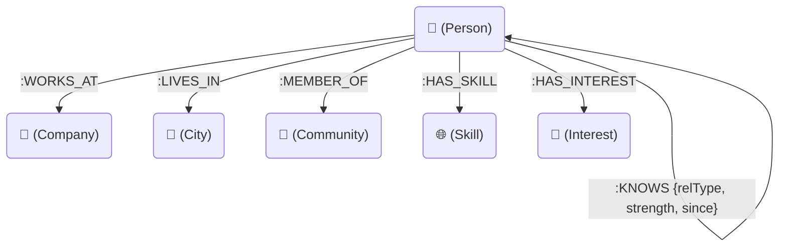
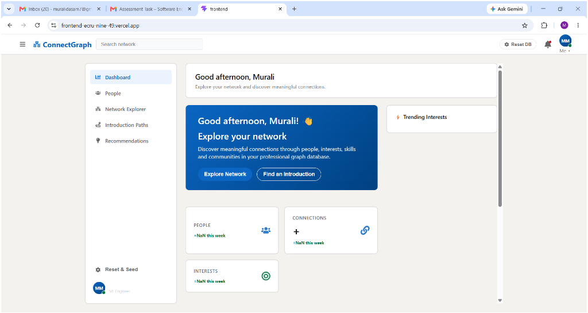
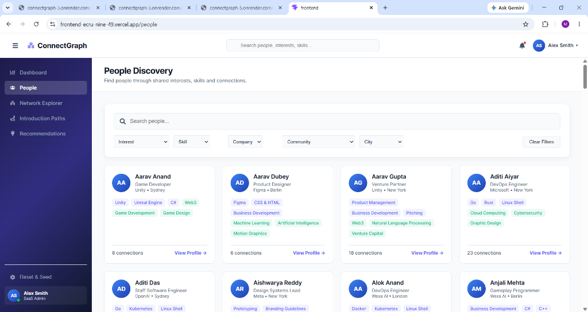
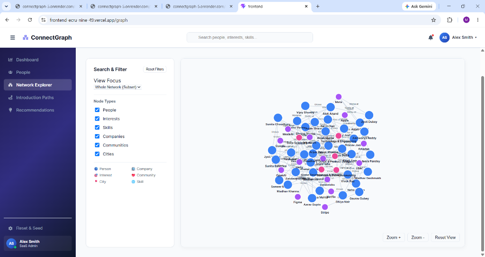
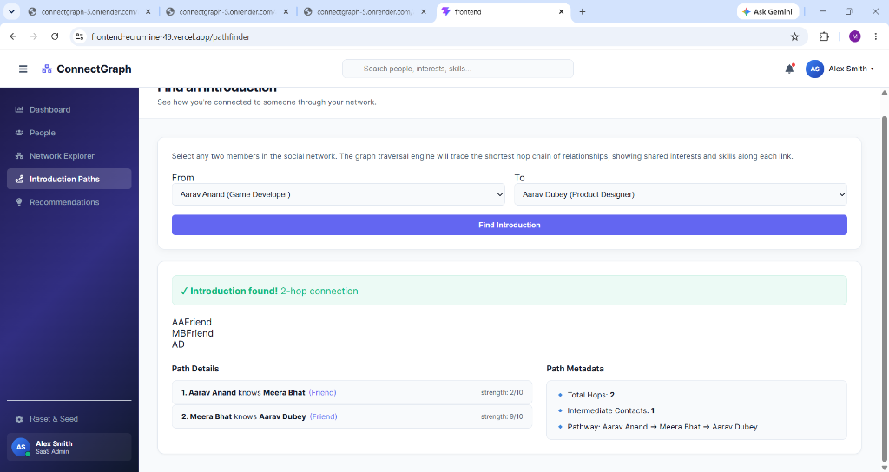
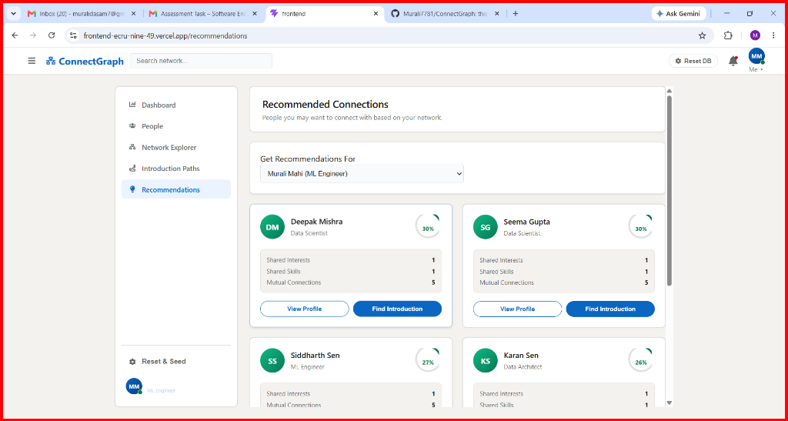
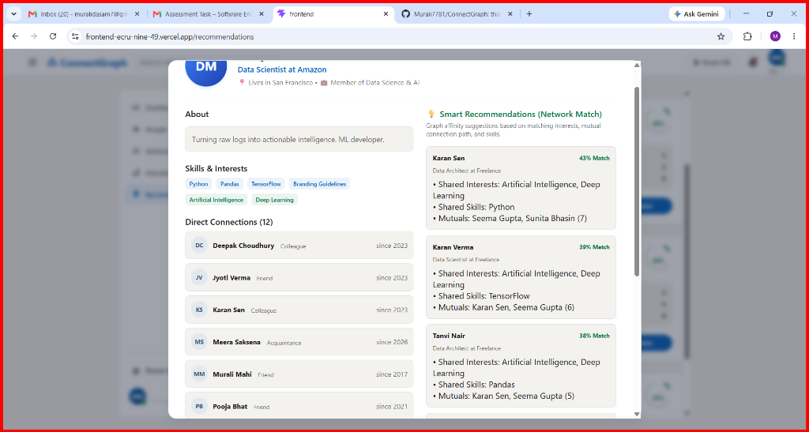

# ConnectGraph

ConnectGraph is a relationship-driven social and professional networking application built for the Wexa AI take-home assignment. The project demonstrates how graph database queries map mutual connections, professional skill hubs, interest groups, and multi-hop introduction paths.

The application is backed by **CognoDB Cloud** (or a Neo4j-compatible instance) and features a dual-mode **transparent fallback system** to keep the application 100% operational even if the database is offline.

---

## Overview
ConnectGraph allows users to explore:
* **People**: Profiles of professionals in the network.
* **Connections**: Direct relations between individuals.
* **Interests**: Shared interest nodes connecting communities.
* **Skills**: Specific professional capabilities linking members.
* **Companies**: Affiliations showing where members work.
* **Communities**: Groups and organizations.
* **Introduction Paths**: Traversal chains showing how you can get introduced to someone.
* **Recommendations**: Smart, similarity-based connection suggestions.

---

## Features
* **Interactive Graph Visualization**: Custom force-directed canvas rendering SVG graph representations.
* **Multi-Hop Traversal**: Computes the shortest acquaintance paths between any two members.
* **Similarity Recommendations**: Recommends new contacts using weighted graph overlaps.
* **Robust Error Handling**: Dynamic UI fallback indicators when the database is offline.
* **Responsive Layouts**: Optimizations for mobile, tablet, and desktop screens.

---

## Why a Graph Database?
In standard relational (SQL) databases, entities are stored in rigid tables, and relationships require intermediate join tables. 
* **Nested Joins**: Querying connection paths up to 4 hops deep (Origin → Person A → Person B → Target) requires multiple nested self-joins or recursive CTEs, degrading database read performance exponentially.
* **Complex Recommendations**: Writing a query to find people who share a company, community, skills, and interests requires multiple table joins and aggregations that relational databases find highly awkward.

In **CognoDB** (using openCypher over the Bolt protocol):
* **Index-Free Adjacency**: Relationships are stored as physical pointers directly on disk, eliminating runtime joins.
* **Traversal Efficiency**: Finding connection pathways takes milliseconds since it hops between adjacent pointers in memory.
* **Single-Statement Recommendations**: Similarity matching based on weighted overlays is expressed clearly in a single parameterized query.

---

## Technology Stack
* **Frontend Client**: React (Vite) styled with clean modern cards, built on a modular SPA architecture.
* **Backend Server**: Express with Node.js and TypeScript.
* **Database Layer**: CognoDB Cloud queried using the official `neo4j-driver` over Bolt.
* **Routing**: React Router v6.

---

## Architecture
* **Frontend (Vercel)**: Single Page Application configured with SPA rewrites (`vercel.json`) to prevent 404 errors on page refreshes.
* **Backend (Render)**: Express server serving REST endpoints (CORS enabled) that communicate with CognoDB.
* **Database (CognoDB)**: Labeled nodes and typed relationships representing the professional social graph.

---

## Data Model
The application models a professional network containing 6 distinct node labels and 6 relationship types.

### Schema Diagram



---

## Graph Relationships
The 6 relationship types mapped in the database:
1. `WORKS_AT`: Connects a `Person` to a `Company`.
2. `LIVES_IN`: Connects a `Person` to a `City`.
3. `MEMBER_OF`: Connects a `Person` to a `Community`.
4. `HAS_SKILL`: Connects a `Person` to a `Skill`.
5. `HAS_INTEREST`: Connects a `Person` to an `Interest`.
6. `KNOWS`: Connects a `Person` to another `Person` (contains properties: `since` [date], `strength` [integer], `relType` [Acquaintance/Colleague]).

---

## Main Cypher Queries

### Multi-hop Introduction Path
Retrieves the shortest path of acquaintance (up to 4 hops deep) between two individuals:
```cypher
MATCH (start:Person {id: $from})
MATCH (target:Person {id: $to})
MATCH path = shortestPath((start)-[:KNOWS*..4]-(target))
RETURN path
```

### Recommendations
Generates connection recommendations, prioritizing shared nodes and mutual connections (Company: +3, Community: +2, Interest: +5, Skill: +3, Mutual connection: +4):
```cypher
MATCH (p:Person {id: $id})
MATCH (other:Person)
WHERE other.id <> $id AND NOT (p)-[:KNOWS]-(other)

OPTIONAL MATCH (p)-[:WORKS_AT]->(co:Company)<-[:WORKS_AT]-(other)
WITH p, other, CASE WHEN co IS NOT NULL THEN 3 ELSE 0 END AS companyScore

OPTIONAL MATCH (p)-[:MEMBER_OF]->(comm:Community)<-[:MEMBER_OF]-(other)
WITH p, other, companyScore, CASE WHEN comm IS NOT NULL THEN 2 ELSE 0 END AS communityScore

OPTIONAL MATCH (p)-[:HAS_INTEREST]->(i:Interest)<-[:HAS_INTEREST]-(other)
WITH p, other, companyScore, communityScore, collect(DISTINCT i.name) AS sharedInterests, count(DISTINCT i) * 5 AS interestScore

OPTIONAL MATCH (p)-[:HAS_SKILL]->(s:Skill)<-[:HAS_SKILL]-(other)
WITH p, other, companyScore, communityScore, sharedInterests, interestScore, collect(DISTINCT s.name) AS sharedSkills, count(DISTINCT s) * 3 AS skillScore

OPTIONAL MATCH (p)-[:KNOWS]-(m:Person)-[:KNOWS]-(other)
WITH p, other, companyScore, communityScore, sharedInterests, interestScore, sharedSkills, skillScore, collect(DISTINCT m.name) AS mutualConnections, count(DISTINCT m) * 4 AS mutualScore

WITH other, sharedInterests, sharedSkills, mutualConnections,
     (companyScore + communityScore + interestScore + skillScore + mutualScore) AS rawScore
WHERE rawScore > 0

RETURN other {.*} AS person, sharedInterests, sharedSkills, mutualConnections,
       CASE WHEN rawScore > 100 THEN 100 ELSE rawScore END AS score
ORDER BY score DESC
LIMIT 6
```

---

## Project Structure
```text
ConnectGraph/
├── backend/
│   ├── src/
│   │   ├── db.ts             # Database connection logic
│   │   ├── seed.ts           # Seeding script
│   │   ├── server.ts         # REST API endpoints
│   │   └── test_queries.ts   # Verification script
│   └── package.json
├── frontend/
│   ├── src/                  # React source files
│   ├── vercel.json           # Client routing configuration
│   └── package.json
└── README.md
```

---

## Setup

### CognoDB Setup
1. Create a free account at [console.cognodb.com](https://console.cognodb.com).
2. Spin up a free database instance.
3. Download the connection credentials file.

### Environment Variables
Create a `.env` file inside the `backend/` directory:
```env
COGNODB_URI=bolt+s://<instance-id>.databases.cognodb.cloud
COGNODB_PASSWORD=<your-generated-password>
PORT=5000
```
Create an environment variable in **Vercel** for the frontend:
```env
VITE_API_BASE=https://connectgraph-5.onrender.com/api
```

### Backend Setup
```bash
cd backend
npm install
```

### Seed Data
Seed the database with realistic people, interests, and relationship nodes:
```bash
cd backend
npm run seed
```

### Frontend Setup
```bash
cd ../frontend
npm install
```

---

## Screenshots

### Dashboard


### People Discovery


### Network Explorer


### Introduction Paths


### Recommendations


### Profile Details (Smart Connections Match)



---

## Live Demo
* **Frontend**: [Vercel Deployment Link](https://frontend-ecru-nine-49.vercel.app/)
* **Backend**: [Render Deployment URL](https://connectgraph-5.onrender.com/api/people)

---

## Verification / Testing
To run the query suite check:
```bash
cd backend
npm run verify
```

---

## Submission Notes
* All Neo4j driver queries are fully parameterized.
* Frontend layout features responsive design optimizations for mobile (320px) to desktop (1920px+).
